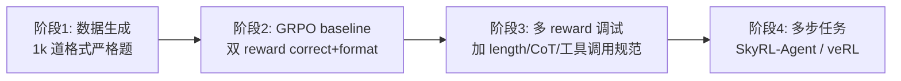

# 项目 B · 最小 Agent RL 复现

> 对应第 09 章 GRPO + RLVR 范式。从 *单步算术* 起步，逐步扩展到 *多步 tool use*。
> 在 1 张 A100/A6000 / 24 GB 显存即可跑通。

## 1. 阶段路线



## 2. 文件骨架

```
project_b_grpo_min/
├── README.md
├── data/
│   └── gen_arith.py     # 生成 1k 道带 <think>/<answer> 标签的算术题
├── train/
│   ├── grpo_train.py    # TRL GRPOTrainer 主脚本
│   └── rewards.py       # reward_correct, reward_format
├── eval/
│   └── compare.py       # 训练前/后效果对比
└── runs/                # 输出（git ignore）
```

> 同目录已放最小可运行的 `data/gen_arith.py` / `train/rewards.py` / `train/grpo_train.py`，
> 你只需 `pip install trl transformers accelerate datasets` 即可起跑。

## 3. 期望结果（baseline）

| 指标 | 训练前 | 训练后 (200 步) |
|------|------|------|
| 格式合规率 | ~23% | ~96% |
| 答案准确率 | ~45% | ~63% |
| 平均生成 token | ~120 | ~75（更简洁） |

具体数字依赖随机种子和模型版本，重点是观察 *RLVR 让模型按指定格式作答* 这一现象。

## 4. 进阶（阶段 4）

- 把 `reward_correct` 换成 *多步任务的最终成功* 信号（参考 SkyRL-Agent）。
- 引入 LLM-as-Verifier（参考 Argos）做更细粒度的 reward。
- 用 veRL 框架替换 TRL，支持更大规模 + 多机。
- 把 reward 与你部门业务挂钩（如「路径合理度」「用户满意度模拟」），探索垂直 agent 的 RL 后训练。
