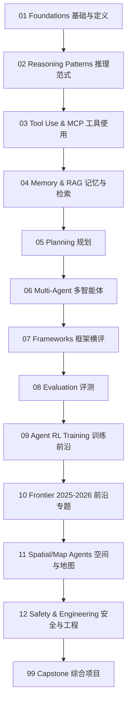

# Agents Guide · LLM 智能体研究学习仓库

> 面向「即将入职互联网公司地图定位算法岗」的研究导向 LLM Agent 学习路径。
> 内容覆盖：基础理论 → 核心范式 → 工程框架 → 评测 → Agent RL 前沿 → 地图/空间智能桥接。

## 关于本仓库

本仓库不是又一份「调几行 LangChain API」的入门教程，而是一份 **研究导向 + 业务桥接** 的系统化学习材料：

- **理论与论文为骨**：每一章先给出综述、关键论文笔记、思想演进图。
- **代码与实验为肉**：每一章配 1-3 个最小可运行 Jupyter Notebook，鼓励动手对比。
- **面向算法岗**：附思考题、面试题、SOTA 对比表，便于复习与拓展。
- **面向地图/定位业务**：单设 `09_agent_rl_training` 和 `11_spatial_map_agents` 两条专属脉络，把 Agent 与你的工作场景对接。

> 阅读建议：第一遍按目录顺序通读 README + 论文笔记，建立全局图谱；第二遍按兴趣 / 项目需要深入做 notebook。

## 学习路径



## 章节速览

| # | 章节 | 关键词 | 核心产出 |
|---|------|-------|---------|
| 01 | [Foundations](./01_foundations/) | Agent 定义、workflow vs agent、综述 | 复旦/人大综述笔记 + Anthropic 视角对比 |
| 02 | [Reasoning Patterns](./02_reasoning_patterns/) | CoT, ReAct, Reflexion, ToT, LATS | 从零实现 ReAct + GSM8K 子集对比 |
| 03 | [Tool Use & MCP](./03_tool_use_and_mcp/) | Function Calling, MCP, CodeAct | 多工具 Agent + 本地 MCP Server |
| 04 | [Memory & RAG](./04_memory_and_rag/) | Generative Agents, MemGPT, Self-RAG, Agentic RAG | Agentic RAG vs Naive RAG 对比 |
| 05 | [Planning](./05_planning/) | LLM+P, ReWOO, HuggingGPT | ReWOO 复现 + token 消耗对比 |
| 06 | [Multi-Agent](./06_multi_agent/) | AutoGen, MetaGPT, CAMEL, Debate | LangGraph 三智能体协作 |
| 07 | [Frameworks](./07_frameworks/) | LangGraph, LlamaIndex, AutoGen, DSPy | 同任务四框架横评 |
| 08 | [Evaluation](./08_evaluation_and_benchmarks/) | SWE-bench, GAIA, WebArena, tau-bench | 2026 饱和分析 + 子集评测 |
| 09 | [Agent RL Training](./09_agent_rl_training/) | RLHF, DPO, RLVR, GRPO, DAPO, veRL, SkyRL | trl GRPO 最小复现 |
| 10 | [Frontier 2025-2026](./10_frontier_2025_2026/) | Computer Use, Coding Agent, long-horizon | 前沿调研笔记 |
| 11 | [Spatial / Map Agents](./11_spatial_map_agents/) | MapAgent, PReP, DriveLM | 地图 API agent 实战 |
| 12 | [Safety & Engineering](./12_safety_and_engineering/) | Prompt Injection, HITL, 可观测性 | 工程化 checklist |
| 99 | [Capstone](./99_capstone_project/) | 综合项目 | 地图定位 Agent + GRPO 最小训练 |

## 快速开始

```bash
git clone <repo-url> Agents_Guide
cd Agents_Guide
python -m venv .venv && source .venv/bin/activate
pip install -r requirements.txt
cp .env.example .env   # 填入 ANTHROPIC_API_KEY / OPENAI_API_KEY
jupyter lab
```

每个章节的 notebook 都假设：

1. 已设置 `ANTHROPIC_API_KEY` 或 `OPENAI_API_KEY`（默认走 Anthropic）。
2. 复用 `utils/llm_client.py` 的统一封装，避免锁定到单一供应商。

## 章节内统一结构

```text
NN_chapter/
  README.md           # 综述 + mermaid 图 + 论文清单 + 学习目标
  notes/              # 论文逐篇笔记（动机/方法/实验/启发）
  notebooks/          # 可运行 demo
  exercises.md        # 思考题 + 面试题
  references.md       # bibtex / 链接 / 推荐博客
```

## 学习路线参考

详细周度安排见 [ROADMAP.md](./ROADMAP.md)。

- **快速入门（2 周）**：01 → 02 → 03 → 04，能搭出能用的 Agent。
- **进阶（4 周）**：补 05 → 06 → 07 → 08，理解工业级框架与评测。
- **研究/前沿（2-4 周）**：09 → 10 → 11，能跟踪 SOTA 并开始复现。
- **业务桥接（持续）**：11 + 99 项目 A，逐步与你的定位算法工作打通。

## 推荐先读的 5 篇

如果时间紧张，先看这 5 篇论文/资料，能覆盖 80% 的核心思想：

1. **Anthropic, Building Effective Agents**（2024 工程博客）— 区分 workflow 与 agent 的最佳起点。
2. **Yao et al., ReAct: Synergizing Reasoning and Acting in Language Models**（2022）— 现代 agent 的奠基范式。
3. **Park et al., Generative Agents: Interactive Simulacra of Human Behavior**（Stanford 2023）— 记忆与反思机制。
4. **Xi et al., The Rise and Potential of Large Language Model Based Agents: A Survey**（复旦 2023）— 全景综述。
5. **Anthropic, Model Context Protocol（MCP）规范**（2024-2025）— 工具生态的事实标准。

## License

MIT
