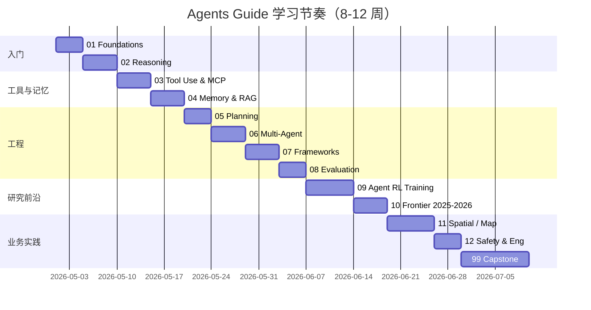

# 学习路线 ROADMAP

LLM Agent 系统化学习的 8-12 周参考计划，建议每周 6-10 小时投入。

## 总体节奏

## 周度计划

### Week 1 — Foundations（01）

- 目标：能用一句话讲清楚「workflow / agent / 多智能体系统」的边界。
- 任务：
  - 通读 `01_foundations/README.md`。
  - 精读：复旦综述前 3 节、Anthropic「Building Effective Agents」全文。
  - 跑通 `01_foundations/notebooks/min_agent_vs_workflow.ipynb`。
- 产出：在 `notes/` 内补充自己的 1 篇综合笔记。

### Week 2 — Reasoning Patterns（02）

- 精读：ReAct, Reflexion, Tree of Thoughts, LATS。
- 实战：从零实现 ReAct，用 GSM8K 子集对比 zero-shot CoT。
- 思考题：哪些场景必须用搜索类（ToT/LATS）？哪些 ReAct 就够？

### Week 3 — Tool Use & MCP（03）

- 精读：Toolformer、CodeAct、MCP 规范。
- 实战：(a) Anthropic tool use 多工具 agent；(b) 用 `mcp` SDK 写一个本地 MCP server。
- 业务联想：把高德/百度地图 API 包装为 MCP server 是什么样？

### Week 4 — Memory & RAG（04）

- 精读：Generative Agents、MemGPT、Self-RAG、Agentic RAG。
- 实战：Naive RAG vs Agentic RAG 命中率对比。
- 思考题：海量地图/POI 数据如何 chunk + 向量化？

### Week 5 — Planning（05）

- 精读：LLM+P、ReWOO、HuggingGPT、Plan-and-Solve。
- 实战：复现 ReWOO，量化 token 节省。
- 类比：路径规划中的 hierarchical planning 与 LLM planner 的异同。

### Week 6 — Multi-Agent（06）

- 精读：AutoGen、MetaGPT、CAMEL、Multi-Agent Debate、Anthropic 多智能体研究。
- 实战：LangGraph 三智能体协作。
- 思考题：多智能体的失败模式（沟通成本、回声室、责任分散）。

### Week 7 — Frameworks 横评（07）+ Evaluation（08）

- 同任务用 LangGraph / LlamaIndex / AutoGen / DSPy 各实现一遍，对比可控性。
- 阅读 SWE-bench / GAIA / WebArena / tau-bench / OSWorld，理解 2026 饱和现象。
- 跑通一个评测子集 demo。

### Week 8-9 — Agent RL Training（09）

- 精读：RLHF → DPO → RLVR；GRPO、DAPO；veRL、SkyRL-Agent、Microsoft Argos。
- 实战：用 `trl` 在小模型上跑 GRPO 最小示例。
- 业务联想：定位算法中的损失/指标（如重定位成功率）能不能转成 RLVR reward？

### Week 10 — Frontier 2025-2026（10）

- 调研：Claude Computer Use、OpenAI Operator、Cursor / Claude Code / Devin / OpenHands、agentic search、long-horizon。
- 产出：自己动手做一份「2026 Agent 生态地图」笔记。

### Week 11 — Spatial / Map Agents（11）

- 精读：MapAgent、PReP、VoP、DriveLM、DriveGPT4、Agent-Driver。
- 实战：调用真实地图 API 搭建「定位 + 路径解释」Agent。
- 思考题：把 GNSS+IMU+视觉 pipeline 抽象成 agent 工具集时的接口设计。

### Week 12 — Safety + Capstone（12 + 99）

- 12：prompt injection、MCP 安全、HITL、可观测性。
- 99：选择一个 capstone：
  - **项目 A**：地图定位 Agent（自然语言 → 工具调用 → 结构化结果 + 解释）。
  - **项目 B**：最小 Agent RL 复现（GRPO + 可验证任务）。

## 推荐论文清单（按章对应）

详见各章节 `references.md`。本路线图只列「必读」核心文献，其余作为延伸：

- 综述：Xi 2023（复旦）、Wang 2023（人大）、Sumers 2024（CoALA）。
- 范式：ReAct、Reflexion、ToT、LATS、Self-Refine。
- 工具：Toolformer、CodeAct、MCP spec。
- 记忆：Generative Agents、MemGPT、Self-RAG、Corrective-RAG、A-MEM。
- 规划：LLM+P、ReWOO、HuggingGPT。
- 多智能体：AutoGen、MetaGPT、CAMEL、Anthropic Research multi-agent blog。
- 评测：SWE-bench、SWE-bench Verified、GAIA、WebArena、tau-bench、OSWorld、TheAgentCompany。
- RL：InstructGPT、DPO、Tülu 3、DeepSeek-R1（GRPO）、DAPO、veRL、SkyRL-Agent、Argos。
- 空间：MapAgent、PReP、VoP、DriveLM、Agent-Driver。

## 自我评估 checkpoint

学习完本仓库后，应当能够：

1. 在白板上画出「LLM Agent 内部循环」（感知 → 推理 → 工具 → 记忆 → 反思）。
2. 解释清楚为什么「workflow ≠ agent」以及何时该用哪个。
3. 用至少两个框架实现同一个任务，并讨论各自取舍。
4. 看懂一篇 Agent RL 论文（如 SkyRL-Agent）的 loss、reward、infra。
5. 设计一个面向地图/定位场景的 agent demo，包括工具集合、memory 策略与评测方案。
